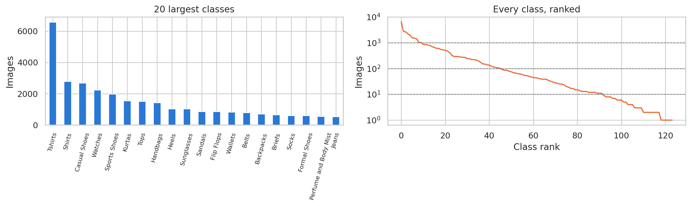
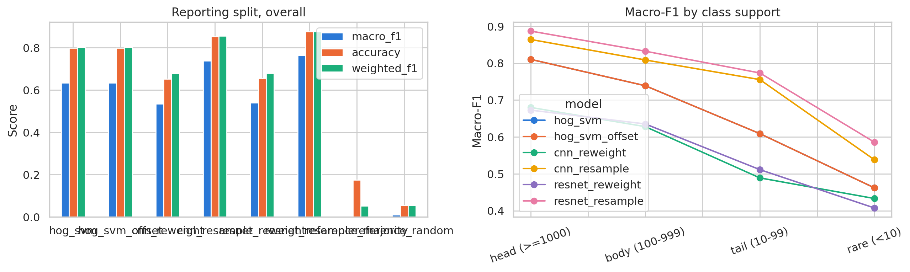
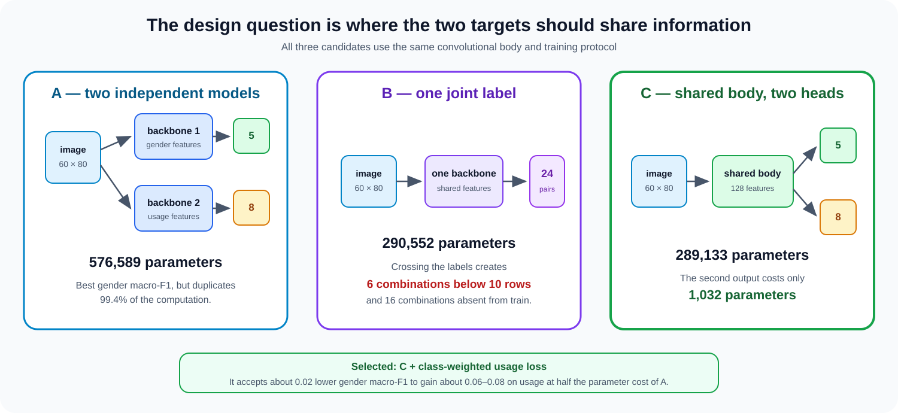
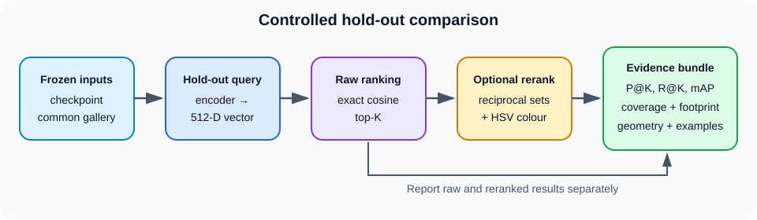

# 👗 Fashion Intelligence System

**A machine-learning system that reads a fashion-catalogue photograph and answers four questions:
what the item is, which season it is for, who it is for and what occasion it suits — then finds
the items that look most like it.**

Built for **COSC2753 Machine Learning · Assignment 2 (2026B) · RMIT University**. Every model in
this repository is trained from scratch on the provided catalogue; pretrained networks appear only
as clearly-labelled reference points, never as a submitted model.

---

## 👥 Team SG_G3

**Lecturer:** Dr. Nguyen Thien Bao

| Name | Student ID |
|---|---|
| Le Duc Huy | s4040502 |
| Nguyen Gia Khang | s4034066 |
| Le Hoang Dang Khoa | s4030327 |
| Tran Hoang Nguyen | s4054071 |
| Nguyen Doan Trung Truc | s3974820 |

---

## 🚀 What the system does

| | Task | Question answered |
|---|---|---|
| 👕 | **Article-type classification** | *What kind of fashion item is this?* — 124 catalogue classes, from `Tshirts` to `Lip Gloss` |
| 🍂 | **Season classification** | *Which season is it intended for?* — Spring / Summer / Fall / Winter |
| 🎯 | **Gender & usage classification** | *Who is it for, and what occasion does it suit?* — two targets from one shared network |
| 🔍 | **Visual search** | *Which catalogue items look most like this one?* — Top-K retrieval over a 34k-image gallery |

---

## 📊 Headline results

Each task reports the metric its own class distribution demands. The catalogue is heavily
long-tailed, so **macro-F1 is the primary metric everywhere** — accuracy alone rewards a model for
ignoring rare classes.

| Task | Submitted model | Primary metric | Runner-up | Floor |
|---|---|---|---|---|
| **1 · Article type** | SmallResNet + resampling | **macro-F1 0.7654** (acc 0.8735) | CNN + resampling 0.7447 | HOG+SVM 0.6345 |
| **2 · Season** | DenseNet-121 | **macro-F1 0.7515** (top-1 0.7561) | EfficientNet-B0 0.7454 | majority 0.1652 |
| **3 · Gender & usage** | Design C, shared body + 2 heads, class-weighted loss + mirror TTA | **gender 0.7202 / usage 0.4676** | Design A, two models | 1-NN 0.534 / 0.327 |
| **4 · Visual search** | ArcFace (ResNet-18) + k-reciprocal & HSV reranking | **mAP@10 0.7755** (P@1 0.7986) | SupCon 0.7274 | CAE 0.5024 |

**Reference points, not submissions.** Pretrained networks were evaluated purely to locate our
from-scratch results on the wider scale: a SigLIP2 linear probe reaches macro-F1 `0.8219` on Task 1,
and FashionCLIP reaches raw mAP@10 `0.6918` on Task 4 — below our ArcFace `0.7702`, because ArcFace
is trained directly against the relevance labels the benchmark scores.

> **On Task 3's `usage` score.** `0.4676` is not an under-trained model. Four of the eight `usage`
> classes rest on 79 training images between them, and an oracle handed the *true* `articleType`
> still scores only macro-F1 `0.3872`, with `0.0000` on all four rare classes. The ceiling is in the
> catalogue's labelling, and the notebook measures it two independent ways rather than asserting it.

---

## 🖼️ Inside the investigation

**The class imbalance every design decision answers to**



**Task 1 — five models under one protocol, scored once on a held-out reporting split**



**Task 3 — three ways to attach two labels to one convolutional body**



**Task 4 — the controlled retrieval benchmark**



---

## 📁 Repository structure

```
.
├── notebooks/
│   ├── 00_eda_and_preprocessing.ipynb    # audit, dedup, conflict resolution → train_manifest.csv
│   ├── 01_final_prediction.ipynb         # combines all four tasks into the submission CSV
│   ├── task1/                            # article-type classification
│   ├── task2/                            # season classification
│   ├── task3/                            # gender & usage classification
│   └── task4/                            # 00 preprocessing → 05 ArcFace → 06 final benchmark
├── src/                                  # shared library: data, models, training, retrieval, metrics
│   ├── data_paths.py                     # the one resolver every task uses to find the data
│   ├── preprocessing.py  task2_utils.py  external_data.py
│   └── task1/  task3/  task4/            # task1 also holds its inference & packaging scripts
├── splits/                               # frozen split files — every task evaluates on these
│   ├── task1/  fit.csv · tuning.csv · reporting.csv
│   ├── task2_season_split.csv
│   ├── task3/  train_val_grouped_sha256.csv
│   └── task4/  train.csv · test.csv
├── preprocessed_datasets/
│   └── train_manifest.csv                # the audited 37,847-row manifest all tasks read
├── artifacts/                            # task*/submitted/ is tracked; the rest is on Drive
├── predictions/                          # submission CSVs, plus task 3's consolidated result tables
├── tests/                                # self-tests for the shared code
├── docs/                                 # provenance for the externally collected sets
├── datasets/                             # course data (gitignored)
├── Dataset/                              # externally collected images (gitignored)
├── pyproject.toml · uv.lock              # locked environment
└── README.md
```

---

## 🗂️ Dataset & preprocessing

The course dataset holds roughly **38.6k catalogue images** for training and **5,829** for testing.
`00_eda_and_preprocessing.ipynb` does not take it at face value — it audits the data and writes a
single manifest every downstream notebook reads:

| Stage | Rows |
|---|---:|
| Raw metadata | 38,617 |
| Rows with a readable image | 38,612 |
| After collapsing 616 consistent duplicate groups | 37,870 |
| After resolving 23 label conflicts | **37,847** |

Along the way it finds **636 duplicate image groups** covering 1,399 images, and **11 test images
byte-identical to a training image** — the kind of contamination that silently inflates a test score
if nobody looks.

Target cardinality: `articleType` 124 · `season` 4 · `gender` 5 · `usage` 8.

### Where to put the data

**The course data is not committed** (see `.gitignore`) — it is far past what belongs in a Git
repository, and its licence limits it to this assignment. Download `A2_Fashion.zip` from Canvas
and unpack it so the repository looks like this:

```
datasets/
├── train/
│   ├── styles_train.csv
│   └── images_train/            # ~38,600 .jpg
└── test/
    ├── styles_prediction.csv
    └── images_test/             # ~5,800 .jpg
```

That is the only layout you need to get right. Every notebook and script resolves the data through
[`src/data_paths.py`](src/data_paths.py), which also accepts the folder the course archive unpacks
to (`datasets/FashionDataset/…`), a Colab mount, and `A2_DATA_ROOT=/somewhere/else` for a machine
that keeps the images on another drive. If something is missing it says so once, naming every path
it looked in, instead of failing several cells later.

```console
python -c "from src import data_paths; data_paths.check(); print(data_paths.describe())"
```

**The submitted models are in the repository** — one per task, plus Task 4's encoded gallery,
because retrieval ranks a query against a catalogue and the encoder alone answers nothing. 197 MB
in total, and it is what lets a clone predict without a Drive link. What stays on Drive is the
material a prediction does not need: the losing candidates, the training history and the run
evidence. Each `artifacts/task*/README.md` says what it holds and how to get the rest.

### Externally collected data

The brief asks for extra-collecting (§ preprocessing) and for an **independent evaluation** on data
from outside the provided scope (§3.3, required from CR up). Both exist and are distributed through
the Drive folder `A2_ExternalData`, unpacked into `Dataset/` — code and provenance are committed,
the images are not:

| set | role | images | licence |
|---|---|---|---|
| `ExternalCosmetics` | extra **training** rows | 1,200 | CC0 |
| `ExternalCosmetics2` | extra **training** rows | 699 | CC BY 4.0 |
| `ExternalEval` | **independent evaluation — never train on it** | 261 | CC BY / CC0 / PDM |

All three are gated to **zero overlap** with the provided train and test sets. Task 1 additionally
ships its own 60-image independent evaluation set, which *is* committed, under `data/external_task1/`.

Adding them to a training run is one line, and it is a **per-target** decision. The rows were chosen
to fill `articleType` classes that are starved *and* concentrated in the region the graded test set
comes from, so Tasks 1 and 2 are where a gain is plausible. On **Task 3 there was no measurable
effect on either target** — four runs across two platforms, sign flipped both times.

```python
training, validation = pp.make_split(frame, TARGET)
training = ed.add_to_training(training, TARGET)   # the only new line
```

`add_to_training` takes the **training** frame, not the manifest: appending external rows before the
split would put some of them in validation, and every with/without comparison would stop meaning
anything. Read **[docs/EXTERNAL_DATA.md](docs/EXTERNAL_DATA.md)** before using them — provenance,
licences, the attribution obligation, the leakage evidence and the caveats that belong in the report.

```console
python src/verify_external_data.py --domain-gap    # reproduces the measured domain gap
uv run pytest tests/test_external_data.py          # 11 gates, skips cleanly without the images
```

---

## ⚙️ Setup

Requires **Python 3.12.0**. The environment is locked with [`uv`](https://docs.astral.sh/uv/).

```bash
git clone https://github.com/SALtruc/Machine-Learning-Assignment-2.git
cd Machine-Learning-Assignment-2
```

Install `uv` if you do not have it:

```bash
# macOS / Linux
curl -LsSf https://astral.sh/uv/install.sh | sh

# Windows PowerShell
irm https://astral.sh/uv/install.ps1 | iex
```

Then create `.venv` and install the locked dependencies:

```bash
uv --version
uv sync --frozen
```

PyTorch resolves against the CUDA 12.8 index on Linux and Windows; FAISS installs as `faiss-gpu`
on Linux and `faiss-cpu` on Windows.

---

## 🎯 Reproducing the submission

**Clone, drop the data in, run one notebook.** The four submitted models are committed, so
nothing here needs a Drive link or a GPU:

```bash
git clone https://github.com/SALtruc/Machine-Learning-Assignment-2.git
cd Machine-Learning-Assignment-2
uv sync --frozen                       # Python 3.12.0, pinned by uv.lock
# unpack A2_Fashion.zip into datasets/ as shown above
uv run jupyter notebook notebooks/01_final_prediction.ipynb   # Run All
```

Section 3 of that notebook loads each task's checkpoint from `artifacts/` and runs it, then
merges the four label columns into the issued template. It refuses to write unless every
column is complete, and records a SHA-256 of each input in a manifest beside the output.

| Task | Model in git | Run it alone |
|---|---|---|
| 1 · article type | `artifacts/task1/submitted/` | `python -m src.task1.task1_inference --template <csv> --image-dir <dir> --output <csv>` |
| 2 · season | `artifacts/task2/submitted/` | `python -c "from src.task2_utils import predict_test_set; predict_test_set()"` |
| 3 · gender & usage | `artifacts/task3/submitted/` | `python src/task3/predict_test.py` |
| 4 · visual search | `artifacts/task4/submitted/` | `python src/task4/retrieve_topk.py --images datasets/test/images_test` |

Task 4 is a retrieval system and therefore has **no column in `styles_prediction.csv`** — the
brief asks it for the Top-K similar items, which is a ranking, not a label. It writes one row
per (query, rank) pair to `predictions/task4/`, and the classification CSV keeps the issued
format exactly.

> **This was verified, not assumed.** The repository was checked out into an empty directory,
> given only the course data, and run: Tasks 1 and 3 re-predicted from their committed
> checkpoints, and the resulting CSV is **byte-identical** to the submitted
> `predictions/final/COSC2753_A2_SG_G3_…csv` — 204,438 bytes, SHA-256 `3b6b6930…`.

Re-training is a different matter, and needs a GPU and the rest of `artifacts/` from Drive.
The section below is for that.

---

## ▶️ Running the notebooks

Launch Jupyter from the repository root and select the project's `.venv` kernel:

```bash
uv run jupyter notebook
```

Run them in this order — later notebooks read what earlier ones write:

| Order | Notebook | Produces |
|---|---|---|
| 1 | `notebooks/00_eda_and_preprocessing.ipynb` | `preprocessed_datasets/train_manifest.csv` |
| 2 | `notebooks/task1/01_task1_article_type_classification.ipynb` | Task 1 models, tables, figures, predictions |
| 3 | `notebooks/task2/…` | Task 2 checkpoints, comparison, predictions |
| 4 | `notebooks/task3/03_task3_gender_usage_nguyen.ipynb` | Task 3 checkpoint, `predictions/task3/` |
| 5 | `notebooks/task4/00…05` then `06_final_benchmark.ipynb` | Five retrieval models, then the hold-out benchmark |
| 6 | `notebooks/01_final_prediction.ipynb` | the combined submission CSV |

Only step 6 is needed to reproduce the submission; steps 1–5 retrain the models it loads.

To execute a notebook headlessly and keep its outputs:

```bash
uv run jupyter nbconvert --to notebook --execute \
  notebooks/00_eda_and_preprocessing.ipynb \
  --output 00_eda_and_preprocessing_executed.ipynb \
  --ExecutePreprocessor.timeout=-1
```

**Two notebooks re-run cheaply without a GPU.** Task 3's Section 12 (figures and the
hyper-parameter sensitivity table) and Task 4's Section 7 both read persisted result files and train
nothing. Task 1 runs its pipeline in an embedded distributed runtime and renders the run's figures
in its final cell; the seven run figures are kept in `notebooks/task1/figures/` and the full tables
under `artifacts/task1/tables/`, which travels on Drive rather than in git.

**What each notebook needs before it will run.** Every notebook is saved with its outputs, so the
results can be read without re-executing anything. To actually re-execute:

| Notebook | Needs |
|---|---|
| `00_eda_and_preprocessing` | the `datasets/` layout above. CPU only, a few minutes |
| `task1/01_…` | a CUDA GPU — `ALLOW_CPU = False`, because ResNet training on CPU presents as a hang. Set `KAGGLE = True` in its first cell to run it from the Kaggle bundle that `src/task1/build_kaggle_bundle.py` packs instead |
| `task3/03_…` | a GPU for sections 2–11; Section 12's figures read `predictions/task3/` and need nothing. Section 7 skips itself when the externally collected images are absent |
| `task4/00…06` | a GPU, and `artifacts/task4/` from the team Drive for `06` — it benchmarks five frozen checkpoints rather than training them |
| `01_final_prediction` | the per-task prediction CSVs under `predictions/`; it trains nothing |

> **Re-running Task 3, or Task 4's `00_preprocessing`, will not reproduce their saved numbers
> exactly.** Both runs read a shared catalogue table of **37,745** rows that was staged on Drive
> and is not in this repository; the audited manifest here holds **37,847** — the same images plus
> 102 the earlier table had dropped. Every one of the 37,745 is present in the manifest, so nothing
> is lost, but the splits are redrawn and the metrics move slightly. Task 4's notebooks `01`–`06`
> are unaffected: they read the frozen `splits/task4/` CSVs, not the table.

---

## 🧠 What each task investigates

**Task 1 — Article type.** HOG+linear-SVM, a plain CNN and a SmallResNet, each under two imbalance
regimes (re-weighting and resampling), compared on disjoint fit / tuning / reporting splits.
Hyperparameters and checkpoint epochs are chosen on tuning only; recipes are frozen, refitted on
fit+tuning, then scored once. Paired bootstrap intervals report which gaps are real — the
ResNet-vs-CNN interval `[-0.0020, +0.0393]` includes zero, and the notebook says so.

**Task 2 — Season.** Random Forest on engineered features against two fine-tuned CNN families, with
a majority-class floor and an equal-weight selection score across five metrics.

**Task 3 — Gender & usage.** Information theory first: `gender` and `usage` are nearly independent
(11.5% / 9.5% mutual-information reduction) but both strongly tied to `articleType` (66.8% / 43.1%),
which argues for sharing features rather than labels. Three designs are then measured, repeated
across seeds and platforms, with class weighting, logit adjustment, TTA, same-dataset auxiliary
pretraining and externally collected data — two of which were **rejected on their own evidence**.
The shipped checkpoint is the *median* of three runs, not the best.

**Task 4 — Visual search.** A development ladder where each model answers the previous one's
limitation: convolutional autoencoder → triplet margin → supervised contrastive → multi-similarity
→ ArcFace, each tuned with Optuna against validation mAP@10. All five are then frozen and scored on
one common hold-out gallery, with raw cosine and reranked results reported separately so
post-processing is never mistaken for representation quality.

---

## 🌐 Live demo

A web interface for trying the classifiers on your own image:

**🔗 [truc-ml-web-dmz9.vercel.app](https://truc-ml-web-dmz9.vercel.app/)**

> The deployed service is a separate application with its own model lineage and may lag the
> checkpoints selected in these notebooks. **The notebooks and their saved outputs are the
> authoritative results** for every number quoted in the report.

---

## 📏 Working rules

These kept five people's results comparable:

1. **Never invent a validation split.** Everyone evaluates on the frozen files in `splits/`.
2. **macro-F1 is primary**, reported alongside accuracy and a confusion matrix. The data is
   long-tailed; accuracy on its own is misleading.
3. **No external pretrained weights in any submitted model.** Pretrained networks appear only as
   labelled reference comparisons, and Task 3's "same-dataset pretraining" means pretraining on this
   dataset's own `articleType` labels.
4. **Datasets and weights stay out of Git.**
5. Prediction files keep the issued format exactly: `id,gender,articleType,season,usage`.

---

## 📚 Acknowledgements

Dataset provided through RMIT Canvas for **COSC2753 Machine Learning**, educational use only.
Methods build on published work cited in full in each notebook's reference section — among them
k-reciprocal re-ranking (Zhong et al., 2017), ArcFace (Deng et al., 2019), supervised contrastive
learning (Khosla et al., 2020), multi-similarity loss (Wang et al., 2019), logit adjustment
(Menon et al., 2021) and FashionCLIP (Chia et al., 2022).

> This repository is coursework. Keep it **private** until after grading.
